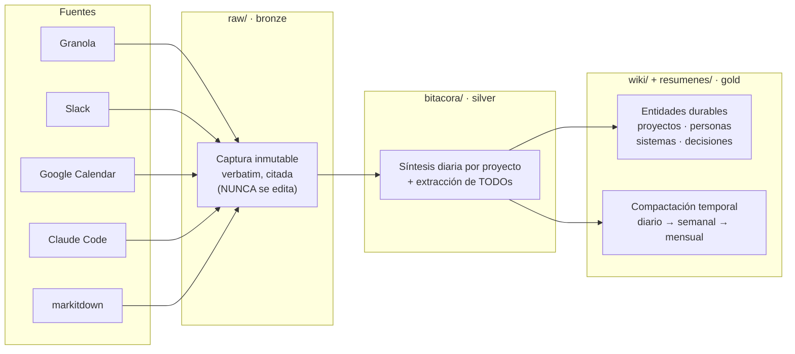

# Second Brain — LLM Wiki (template)

Base de conocimiento personal de trabajo, mantenida por Claude Code.
Inspirada en el patrón LLM Wiki de Andrej Karpathy, ajustada a un flujo de Data Engineering.

> **¿Recién llegás?** Leé `README.md`: explica qué es, los prerequisitos, y los placeholders que tenés
> que completar (tu nombre, tu key de Jira, zona horaria, canales de Slack, etc.) para hacerlo tuyo.

## Propósito

Este vault es un **second brain**: un knowledge base estructurado e interlinkado que captura el
trabajo diario desde múltiples fuentes, lo sintetiza en una bitácora diaria, lo compacta en
resúmenes temporales y promueve el conocimiento durable a páginas de wiki interconectadas.

Claude mantiene el vault. El humano cura fuentes, hace preguntas y guía el análisis.

- Idioma: **español rioplatense** (voseo argentino) por defecto. Zona horaria: `America/Buenos_Aires`
  (UTC-3). Ambos son configurables — ajustá a tu gusto (ver `README.md`).
- Es a la vez un **vault de Obsidian** → usar sintaxis Obsidian: wikilinks `[[pagina]]`, callouts
  `> [!note]`, properties YAML en frontmatter, y Bases (`.base`) para dashboards.

## Modelo: bronze → silver → gold (medallion)

Mismo patrón que `LANDING → INTEGRATION → MARTS` en un data warehouse:



## Estructura de carpetas

```
raw/          -- captura cruda e inmutable de cada fuente (NUNCA modificar)
  granola/    -- transcripts de meetings (cache local de Granola)       YYYY-MM-DD-<slug>.md
  slack/      -- hilos/DMs/menciones relevantes (Slack MCP)             YYYY-MM-DD-<canal>.md
  calendar/   -- eventos del día (Google Calendar MCP)                  YYYY-MM-DD.md
  claude/     -- digest de sesiones de Claude Code                      YYYY-MM-DD.md
  docs/       -- archivos/URLs convertidos con markitdown               YYYY-MM-DD-<slug>.md
bitacora/     -- nota diaria sintetizada (silver)                       YYYY-MM-DD.md
resumenes/
  semanal/    -- rollup de la semana ISO                                YYYY-Www.md
  mensual/    -- rollup del mes                                         YYYY-MM.md
wiki/         -- páginas curadas e interlinkadas (gold)
  index.md    -- tabla de contenidos del wiki
  log.md      -- registro append-only de operaciones
  proyectos/  -- una página por iniciativa/proyecto
  personas/   -- una página por persona/contacto
  sistemas/   -- una página por sistema/herramienta/concepto técnico
  decisiones/ -- decisiones importantes con fecha                       YYYY-MM-DD-<slug>.md
  biblioteca/ -- artículos/videos/papers curados (conocimiento externo) <slug>.md
todos/        -- un archivo por TODO (frontmatter: estado/proyecto/due/origen)  <accion>.md
todos.base    -- board de los TODOs en todos/
proyectos.base-- dashboard de wiki/proyectos
biblioteca.base-- catálogo navegable de la biblioteca
```

## Flujo de ingesta

Hay una skill por fuente (en `.claude/skills/`). Todas son **idempotentes** y escriben en `raw/<fuente>/`:

| Skill | Fuente | Qué hace |
|---|---|---|
| `/capturar-claude` | `~/.claude/projects/*/*.jsonl` | Corre `.claude/scripts/extract_claude_sessions.py`, agrupa por proyecto y escribe el digest del día. |
| `/capturar-granola` | cache local de Granola | Descifra el cache local cifrado y captura transcripts nuevos (skip por `meeting_id` ya capturado). |
| `/capturar-slack` | Slack MCP | Captura DMs, menciones y hilos relevantes de la ventana. |
| `/capturar-calendar` | Google Calendar MCP | Eventos del día; cross-linkea con transcripts de Granola. |
| `/ingest <fuente>` | markitdown · `gog` (Google Suite) | Convierte un archivo/URL a markdown. Links de Google Docs/Sheets/Slides/Drive se bajan con `gog`; el resto con markitdown. Modo ingesta (→ `raw/docs/`) o modo efímero (razonar sin persistir). |

Cuando ingestás una fuente y querés promover su contenido al wiki:
1. Leé la captura cruda en `raw/`.
2. Discutí los takeaways con el usuario antes de escribir páginas de wiki.
3. Creá/actualizá páginas en `wiki/{proyectos,personas,sistemas,decisiones}`.
4. Conectá con wikilinks `[[pagina]]`.
5. Actualizá `wiki/index.md` y appendeá a `wiki/log.md`.

Una sola fuente puede tocar varias páginas de wiki. Eso es normal.

## Biblioteca de conocimiento — `wiki/biblioteca/`

Base de conocimiento curada de **fuentes externas** (artículos, videos, papers, threads, repos) que
se va consolidando con el tiempo. Flujo: `/ingest <url>` convierte la fuente a markdown (cruda →
`raw/docs/`), y de ahí se destila una **nota curada** en `wiki/biblioteca/<slug>.md`:
```yaml
tags: [recurso]
tipo: articulo        # articulo | video | paper | thread | repo
tema: [snowflake, rbac]
url: https://...
fuente: slack #canal | manual
estado: por-leer      # por-leer | leido
agregado: YYYY-MM-DD
```
Cuerpo: **Resumen** (1-3 oraciones), **Takeaways** (bullets), y `[[wikilinks]]` a los sistemas/
conceptos del vault que toca. `biblioteca.base` la cataloga por tipo/estado/tema.

## Bitácora diaria — `/bitacora`

Genera `bitacora/YYYY-MM-DD.md` sintetizando las capturas de `raw/` del día:
- **Agrupado por proyecto/área**, NO por herramienta (nunca mencionar Claude Code, etc.).
- Tiempo **pasado** ("Se implementó…", "Se coordinó con [[ana-perez]]…").
- `##` para el header de fecha, `###` por proyecto (nunca bold). Bullets con `-`.
- Key de Jira entre paréntesis cuando aplica: `(PROJ-170)`.
- **Dedupe** contra días previos: por Jira key (señal primaria) y substring (fallback). Si ya se
  registró el mismo entregable → omitir; si hay trabajo incremental → describir solo el delta.
- **Extrae TODOs** como tareas `- [ ] … #todo` con properties (`proyecto::`, `origen::`, `due::`).

## Compactación — `/compactar semanal|mensual`

*Hierarchical temporal summarization*:
- **Semanal**: lee `bitacora/` de la semana ISO → `resumenes/semanal/YYYY-Www.md` (logros,
  decisiones, hilos abiertos, métricas de TODOs).
- **Mensual**: lee los semanales del mes → `resumenes/mensual/YYYY-MM.md`.
- **Promoción a `wiki/`**: hechos durables (decisión de arquitectura, persona nueva, sistema) se
  promueven/actualizan en las páginas de wiki con wikilinks. Actualizar `index.md` + `log.md`.

## TODOs — `/todos`

Cada TODO es **una nota** en `todos/` (porque los Bases de Obsidian consultan notas, no checkboxes
inline). Frontmatter:
```yaml
tags: [todo]
estado: pendiente        # pendiente | en-progreso | hecho
proyecto: PROJ-170       # key de Jira o nombre de proyecto (opcional)
due: 2026-06-05          # opcional
origen: raw/granola/...  # de dónde salió (opcional)
created: 2026-05-31
```
El título del archivo es la acción (verbo primero, ej. `revisar-propuesta-sqlfluff.md`).
- `todos.base` los muestra como board agrupado por proyecto/estado.
- La skill `/todos` genera accionables nuevos desde el WIP (bitácora reciente + tickets de Jira abiertos),
  **deduplica contra Jira** y contra los TODOs ya existentes, y no recrea lo que ya es ticket.
- La bitácora del día puede listar "Pendientes detectados" inline; `/todos` los materializa como notas.

## Question answering

Cuando el usuario hace una pregunta:
1. Leé `wiki/index.md` primero para encontrar páginas relevantes.
2. Leé esas páginas y sintetizá una respuesta; citá las páginas de wiki en tu respuesta.
3. Si la respuesta no está en el wiki, decilo claramente.
4. Si la respuesta es valiosa, ofrecé guardarla como página nueva para que el conocimiento componga.

## Búsqueda y recuperación (cómo navega el agente)

A medida que el vault crece, para recuperar bien:
1. **Leé `wiki/index.md`** (MOC vivo) para ubicar el dominio.
2. **Grep por `tema`/tag** del vocabulario controlado en `wiki/_taxonomia.md` — no inventes tags nuevos, usá los de ahí.
3. **Abrí el hub del dominio**: la página en `wiki/sistemas/` actúa de MOC y linkea lo relacionado (hub-and-spoke).
4. **Seguí `[[wikilinks]]` y backlinks** para expandir.
5. **Query Bases** (`proyectos.base`, `todos.base`, `biblioteca.base`) para filtros estructurados (estado/tema/tipo).
Mantené el vocabulario consistente y usá `aliases` para que términos equivalentes caigan en la misma página.

## Formato de página de wiki

```markdown
---
tags: [proyecto|persona|sistema|decision]
aliases: []                           # siglas/variantes (ver wiki/_taxonomia.md)
tema: []                              # tags del vocabulario controlado (wiki/_taxonomia.md)
estado: activo|pausado|cerrado        # solo proyectos
last_updated: YYYY-MM-DD
---

# Título de la Página

**Resumen**: Una o dos oraciones describiendo esta página.

**Fuentes**: archivos de raw/ y/o tickets de los que sale esta página.

---

Contenido principal. Headings claros, párrafos cortos.
Linkear conceptos relacionados con [[wikilinks]] a lo largo del texto.

## Páginas relacionadas
- [[concepto-relacionado-1]]
- [[concepto-relacionado-2]]
```

## Reglas de citación

- Cada claim factual referencia su fuente.
- Formato: `(fuente: raw/granola/2026-05-31-1on1-ana.md)`, key de Jira `(PROJ-170)`, `ts` de Slack,
  o `sessionId` de Claude.
- Si dos fuentes se contradicen, anotá la contradicción explícitamente.
- Si un claim no tiene fuente, marcalo como pendiente de verificar.

## Lint / auditoría del wiki

Cuando el usuario pida lintear el wiki:
- Contradicciones entre páginas; páginas huérfanas (sin inbound links); conceptos mencionados sin
  página propia; claims potencialmente desactualizados; páginas que no cumplen el formato.
- Reportar como lista numerada con fixes sugeridos.

## Privacidad

⚠️ Este vault puede contener **data confidencial** (transcripts de meetings, Slack, detalles de
infra, IAM/PII). Mantené el repo **privado**. No pegar credenciales, claves RSA ni secrets en
ninguna página — referenciar dónde viven (1Password, Secrets Manager), nunca el valor.

## Reglas

- **Nunca** modificar nada en `raw/` (es inmutable, es el backup).
- Después de cambios en el wiki, **siempre** actualizar `wiki/index.md` y appendear a `wiki/log.md`.
- Nombres de página en minúsculas con guiones (ej. `auto-table-creator.md`).
- Español rioplatense (configurable), claro y conciso.
- Ante la duda de cómo categorizar algo, preguntá al usuario.
